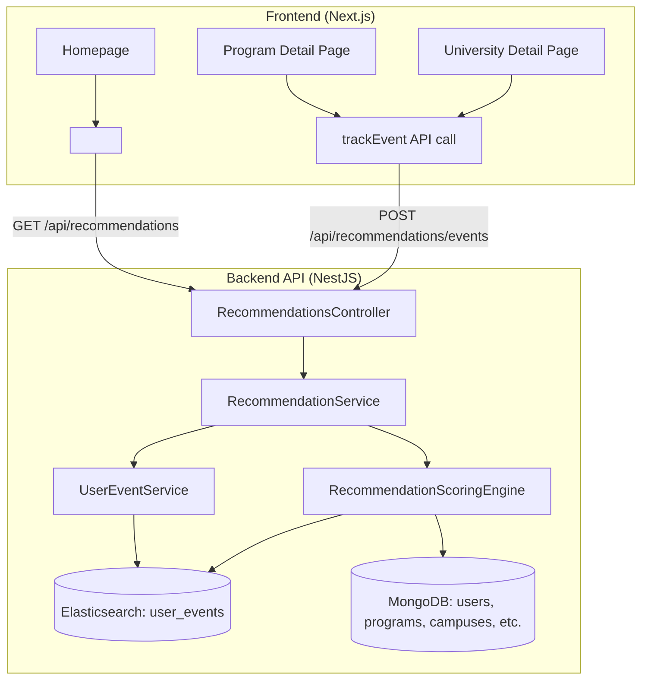

# 🎓 ScholarBee Recommendation System — Implementation Plan

## 1. Executive Summary

Build an **AI-Based Dynamic Recommendation System** that suggests universities and academic programs to students based on:
1. **Onboarding preferences** (cold-start / Phase 1)
2. **Behavioral signals** — clicks, searches, applications, time-spent (warm / Phase 2)
3. **MOU/Partner boost** — `scholarbee_verified` campuses get a controlled ranking advantage

The system is **self-contained** — all new code lives in a new `src/recommendations` module. We **will not modify** existing files except for two minimal integration points:
- Registering `RecommendationsModule` in `app.module.ts`
- Adding a `<RecommendedForYou />` section on the frontend homepage

---

## 2. Data Model Mapping (What We Already Have)

| Contract Requirement | Existing Schema / Field | Notes |
|---|---|---|
| Degree level | `OnboardingPreferences.degree_goal` → maps to `ProgramTemplate.degree_level` | Both use `DegreeLevelEnum` |
| City preference | `OnboardingPreferences.preferred_cities[]` | Match against `Address.city` (via Campus → address_id) |
| Field of interest | `OnboardingPreferences.preferred_fields_of_study[]` | Match against `ProgramTemplate.field_of_study` / `Program.major` |
| Fee range | `OnboardingPreferences.semester_fee_range` `{min, max}` | Match against `FeeStructure.tuition_fee` or calculated per-semester fee |
| Previous marks | `OnboardingPreferences.previous_marks_range` `{min_percent, max_percent}` | Used as a soft filter (admission eligibility heuristic) |
| Start timeline | `OnboardingPreferences.start_timeline.type` | Map to `Admission.session_term` + `session_year` |
| MOU boost | `Campus.scholarbee_verified` (boolean) | Weighted boost factor in scoring |
| Click behavior | **NEW** — `user_events` ES index | Track clicks on university/program detail pages |
| Search queries | **EXISTS** — `search_history` ES index | Already tracked via `SearchHistoryAnalyticsService` |
| Applications | `Application` collection | Already tracks user → admission_program submissions |

---

## 3. Architecture Overview



---

## 4. New Module Structure

All new code will be created under:

```
backend-api/src/recommendations/
├── recommendations.module.ts          # NestJS module registration
├── recommendations.controller.ts      # API endpoints
├── services/
│   ├── recommendation.service.ts      # Main orchestrator
│   ├── scoring-engine.service.ts      # Scoring algorithm
│   ├── user-event.service.ts          # Behavioral event tracking
│   └── seed.service.ts               # Demo data seeder
├── dto/
│   ├── get-recommendations.dto.ts     # Query params DTO
│   ├── track-event.dto.ts            # Event tracking DTO
│   └── recommendation-response.dto.ts # Response shape
├── schemas/
│   └── user-event.schema.ts          # MongoDB schema for events (fallback)
├── mappings/
│   └── user-events.mapping.ts        # ES mapping for user_events index
├── constants/
│   └── scoring.constants.ts          # Weights, boost factors, thresholds
└── types/
    └── recommendation.types.ts        # TypeScript interfaces
```

Frontend additions:
```
student-portal/src/
├── components/organisms/recommendedForYou/
│   ├── index.tsx                      # Main component
│   ├── RecommendationCard.tsx         # Individual card
│   └── recommendedForYou.module.css   # Styles
├── hooks/
│   └── useTrackEvent.ts              # Event tracking hook
└── endpoints/
    └── recommendations.ts            # API client
```

---

## 5. Scoring Algorithm Design

### 5.1 Phase 1 — Onboarding Score (Content-Based Filtering)

Each candidate program gets a **relevance score** based on preference matching:

```
OnboardingScore = Σ (weight_i × match_score_i)
```

| Dimension | Weight | Match Logic |
|---|---|---|
| `degree_goal` | **0.25** | Exact match with `ProgramTemplate.degree_level` → 1.0, else 0.0 |
| `preferred_cities` | **0.20** | Campus address city ∈ user preferred_cities → 1.0, else 0.0 |
| `preferred_fields_of_study` | **0.25** | `ProgramTemplate.field_of_study` ∈ user preferred_fields → 1.0, partial match → 0.5 |
| `semester_fee_range` | **0.15** | Fee within range → 1.0, within 20% buffer → 0.5, else 0.0 |
| `previous_marks_range` | **0.10** | Soft eligibility check (future: compare with min entry req) → 1.0 or 0.5 |
| `start_timeline` | **0.05** | Active admission in matching session → 1.0, else 0.5 |

### 5.2 Phase 2 — Behavioral Score (Collaborative Signals)

```
BehavioralScore = Σ (signal_weight × signal_value)
```

| Signal | Weight | How Tracked |
|---|---|---|
| Click on program/university | **0.15** | `user_events` ES index (event_type: 'click') |
| Search query match | **0.10** | `search_history` ES index (existing) |
| Application submitted | **0.30** | `applications` MongoDB collection (existing) |
| Favourite action | **0.20** | `AdmissionProgram.favouriteBy` / `Campus.favouriteBy` (existing) |
| Time on page | **0.10** | `user_events` ES index (event_type: 'dwell_time') |
| Redirect/deeplink click | **0.15** | `AdmissionProgram.redirected_students` (existing) |

### 5.3 MOU Boost Factor

```
FinalScore = (α × OnboardingScore + β × BehavioralScore) × MOUBoostMultiplier
```

- `α = 0.6` (onboarding weight — higher for new users, decays over time)
- `β = 0.4` (behavioral weight — grows as data accumulates)
- `MOUBoostMultiplier`:
  - `1.15` if `campus.scholarbee_verified === true` (15% boost)
  - `1.0` otherwise

> [!IMPORTANT]
> The MOU boost is intentionally capped at 15% to ensure **fair visibility without fully overriding relevance** (per contract §4.3).

### 5.4 Cold-Start Strategy

For new users with **no behavioral data**:
- `β = 0` → pure onboarding-based recommendations
- As behavioral events accumulate (threshold: ≥5 events), α decays from 0.6 → 0.4 and β grows from 0.4 → 0.6
- Fallback: if onboarding is incomplete, return **trending programs** (most clicked/applied in last 30 days from `search_history` + `application_metrics`)

---

## 6. API Endpoints

### 6.1 Get Recommendations

```
GET /api/recommendations
```

| Param | Type | Description |
|---|---|---|
| `limit` | number (default: 20) | Max results |
| `page` | number (default: 1) | Pagination |
| `type` | `'programs' \| 'universities'` | What to recommend (default: programs) |

**Auth**: Required (JWT) — reads user's `onboarding_preferences` + behavioral history

**Response**:
```json
{
  "data": [
    {
      "admission_program_id": "...",
      "program_name": "BS Computer Science",
      "university_name": "NUST",
      "campus_name": "H-12 Islamabad",
      "degree_level": "Bachelors",
      "field_of_study": "Computer Science",
      "tuition_fee": 250000,
      "scholarbee_verified": true,
      "relevance_score": 0.92,
      "match_reasons": ["degree_goal", "preferred_city", "field_of_study"],
      "slug": "nust-h12-bs-computer-science"
    }
  ],
  "meta": {
    "total": 145,
    "page": 1,
    "limit": 20,
    "scoring_mode": "hybrid"  // "onboarding_only" | "behavioral_only" | "hybrid"
  }
}
```

### 6.2 Track User Event

```
POST /api/recommendations/events
```

**Body**:
```json
{
  "event_type": "click",            // click | view | dwell_time | favourite | search
  "resource_type": "admission_program", // admission_program | university | campus | program
  "resource_id": "665a...",
  "metadata": {
    "dwell_time_ms": 45000,         // optional, for dwell_time events
    "source_page": "homepage",      // where the user came from
    "position": 3                   // rank position in the recommendation list
  }
}
```

**Auth**: Required (JWT)

### 6.3 Get Trending (Public Fallback)

```
GET /api/recommendations/trending
```

Returns most popular programs/universities for unauthenticated users or users without onboarding data.

---

## 7. Implementation Phases

### Phase 1: Core Backend (Day 1-2)
1. Create `src/recommendations/` module structure
2. Implement `RecommendationService` with onboarding-based scoring
3. Implement `ScoringEngine` with weighted scoring algorithm
4. Create MongoDB aggregation pipeline for candidate fetching (Programs → ProgramTemplates → Campuses → Addresses → FeeStructures)
5. Register module in `app.module.ts`
6. Create API endpoints with Swagger docs

### Phase 2: Behavioral Tracking (Day 2-3)
1. Create `user_events` ES mapping
2. Implement `UserEventService` for event ingestion
3. Add event tracking endpoint
4. Integrate behavioral signals into scoring engine
5. Implement α/β dynamic weight adjustment based on event count

### Phase 3: Frontend Integration (Day 3-4)
1. Create `useTrackEvent` hook for automatic event tracking
2. Build `<RecommendedForYou />` component with loading states
3. Add recommendation cards with match-reason badges
4. Integrate into homepage
5. Add click tracking to existing program/university detail pages

### Phase 4: Demo & Polish (Day 4-5)
1. Create seed data generator (`seed.service.ts`) with synthetic:
   - User profiles with varied onboarding preferences
   - Behavioral events (clicks, searches, applications)
2. Record demo video showing:
   - New user → onboarding → recommendations
   - Returning user → behavioral refinement
   - MOU-boosted universities appearing higher
3. Technical documentation

---

## 8. Key Design Decisions

| Decision | Rationale |
|---|---|
| **New module, no existing file changes** | Contract restriction: "strictly guided not to touch any other files" |
| **MongoDB aggregation over separate queries** | Single pipeline to join Programs → Templates → Campuses → Addresses → Fees for scoring |
| **Elasticsearch for events, not MongoDB** | Aligns with existing `search_history` pattern; better for time-series + aggregations |
| **Weighted scoring, not ML** | No training data exists; rule-based approach is transparent, explainable, and demo-ready |
| **MOU boost as multiplier, not additive** | Prevents verified campuses from dominating when relevance is low |
| **Hybrid α/β decay** | Smoothly transitions from cold-start to data-rich recommendations |

---

## 9. Questions for You

Before we start coding, I'd like to confirm a few things:

1. **Elasticsearch availability**: Is Elasticsearch running locally? The existing `search_history` analytics already use it. If not available, I can implement event tracking purely in MongoDB as a fallback.

2. **Minimal integration point**: I'll need to add exactly **one import line** in `app.module.ts` to register the new `RecommendationsModule`. Is that acceptable given the "don't touch other files" constraint?

3. **Frontend integration**: Similarly, I'll need to add the `<RecommendedForYou />` section to the homepage (`page.tsx`). Should I keep the frontend work in a completely separate component that can be dropped in with one line?

4. **Demo data**: Should the seed script populate synthetic behavioral events for existing real universities/programs in the database, or should it create entirely new test entities?

5. **Priority**: The contract deadline was May 30 with demo on May 31 (today). Should we focus on getting the **backend scoring engine + API** working first, then frontend, or do you want both in parallel?
