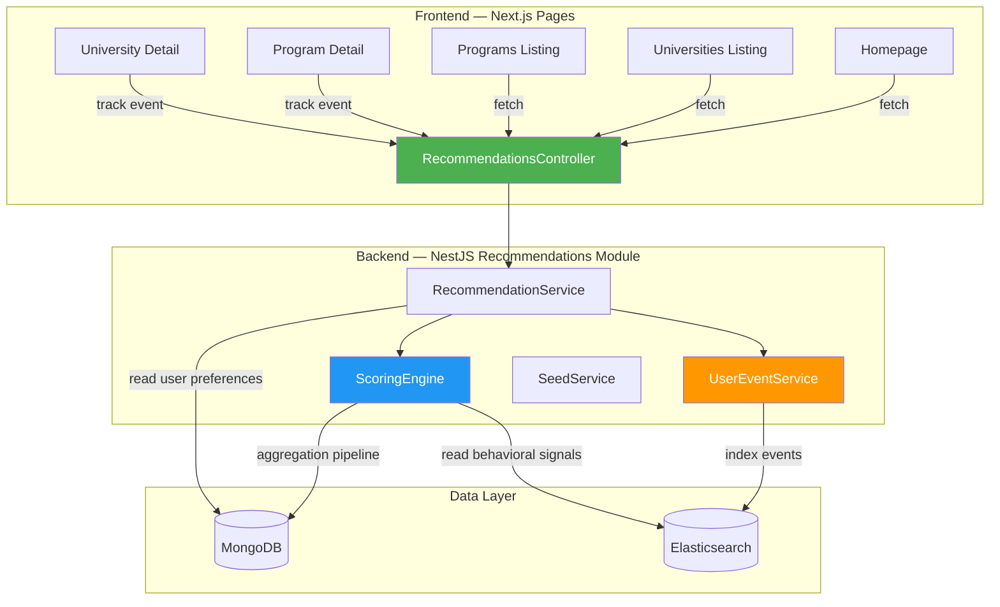

# 🎓 ScholarBee Recommendation System — Implementation Plan

---

## 1. Recommendation System Approaches — Comparison

### Option A: Pure Content-Based Filtering (CBF)

**How it works**: Matches user's onboarding profile attributes (degree_goal, preferred_cities, fields_of_study, fee_range) directly against program/university attributes using similarity scoring.

| ✅ Pros | ❌ Cons |
|---|---|
| No cold-start problem — works from Day 1 with onboarding data | Creates a **"filter bubble"** — user only sees what matches their stated preferences |
| Fully transparent and explainable | Cannot discover serendipitous recommendations |
| Simple to implement and debug | Ignores what similar users found useful |
| No dependency on other users' data | Quality entirely depends on onboarding data completeness |
| Works well with structured data (degrees, cities, fees) | If user skips onboarding → no recommendations at all |

---

### Option B: Collaborative Filtering (CF)

**How it works**: Finds users with similar behavior (clicks, applications, favourites) and recommends what those similar users engaged with.

| ✅ Pros | ❌ Cons |
|---|---|
| Discovers unexpected, serendipitous matches | **Severe cold-start problem** — needs thousands of users with behavioral data |
| Gets smarter over time automatically | **Cannot work for new platform** — ScholarBee doesn't have enough behavioral data yet |
| No need for detailed item attributes | "Popularity bias" — popular programs dominate |
| Industry-proven (Netflix, Amazon) | Completely opaque — hard to explain *why* something was recommended |
| | Requires significant infrastructure (matrix factorization, ALS) |

---

### Option C: Knowledge-Based / Rule-Based System

**How it works**: Hard-coded business rules (IF degree=Bachelors AND city=Lahore THEN show X). Domain experts define the matching logic.

| ✅ Pros | ❌ Cons |
|---|---|
| 100% predictable and controllable | Doesn't scale — every new rule must be manually coded |
| Easy to explain to client/demo | Cannot learn or adapt from user behavior |
| No training data needed | Rigid — misses nuanced preferences |
| Fast execution | Maintenance nightmare as rules grow |
| Good for business constraints (MOU boost) | No personalization beyond predefined rules |

---

### Option D: ML-Based Learning-to-Rank (LTR)

**How it works**: Trains a machine learning model (XGBoost, LambdaMART) on user interaction data to learn optimal ranking.

| ✅ Pros | ❌ Cons |
|---|---|
| Best long-term accuracy | **Requires large labeled training dataset** — not available |
| Automatically discovers feature importance | Complex infrastructure (model training pipeline, feature store) |
| Handles non-linear feature interactions | Overkill for current data volume |
| Industry gold standard for search ranking | Needs periodic retraining |
| | Hard to explain to non-technical stakeholders |
| | Way too complex for the timeline |

---

### Option E: Hybrid Weighted Scoring System ⭐ RECOMMENDED

**How it works**: Combines Content-Based matching (onboarding preferences) with lightweight Behavioral signals (clicks, searches, applications) and Business rules (MOU boost) using a transparent weighted scoring formula. Each dimension contributes a normalized score, combined with configurable weights.

| ✅ Pros | ❌ Cons |
|---|---|
| **No cold-start problem** — onboarding alone drives initial recommendations | Not as sophisticated as full ML approaches |
| **Self-improving** — behavioral signals gradually refine results | Weights need manual tuning initially |
| **Transparent** — can show "Why recommended" reasons | May need weight adjustments as user base grows |
| **MOU boost is natural** — just a multiplier in the formula | |
| **Demo-ready** — works with synthetic data immediately | |
| **Explainable** — each score component is traceable | |
| **Leverages existing infrastructure** — MongoDB aggregation + ES | |
| **Graceful degradation** — falls back to trending if no user data | |
| **Scalable** — can evolve toward ML later without rewrite | |

> [!IMPORTANT]
> **Recommendation: Option E (Hybrid Weighted Scoring)** is the optimal choice for ScholarBee's current stage. It solves the cold-start problem using onboarding data, self-improves via behavioral signals, and is fully demo-ready. It can evolve toward ML (Option D) in the future as data accumulates, without requiring an architectural rewrite.

---

## 2. How It Works — Page-by-Page Integration

> [!NOTE]
> **Core Principle**: There is no separate "Recommendations" tab or page. Instead, every listing on every page becomes **personalized** for the logged-in user. The recommendation engine acts as a **transparent re-ranking layer** on top of existing data.

### How each page changes:

| Page | Current Behavior | With Recommendations |
|---|---|---|
| **Homepage → Programs Section** | Shows generic programs (latest/random) | **Personalized**: sorted by recommendation score for the logged-in user |
| **Homepage → Universities Carousel** | Shows universities by city | **Personalized**: user's preferred cities shown first, MOU-boosted campuses ranked higher |
| **Homepage → Partner Universities** | Static partner list | **Re-ranked**: partners matching user's field/degree shown first |
| **Universities Listing** (`/universities`) | All universities, default sort | **Personalized sort**: universities matching user profile ranked higher |
| **Programs Listing** (`/programs`) | All programs, filter-based | **Personalized sort**: programs matching user profile float to top |
| **University Detail** (`/university-details`) | Shows all programs of that university | **"Recommended for you" badges** on programs matching user's profile |
| **Program Detail** (`/program-details`) | Shows single program | **"Similar Programs"** section with personalized similar program suggestions |
| **Search Results** | Keyword match ordering | **Re-ranked**: search results re-ordered by recommendation score |
| **Unauthenticated / No onboarding** | Same as current | **Trending**: shows most popular based on aggregate behavioral data |

### Visual Integration Concept:

```
┌──────────────────────────────────────────────────────┐
│  Homepage (Logged-in User)                            │
│                                                       │
│  ┌─ Programs Section ──────────────────────────────┐  │
│  │  "Programs Recommended For You"                  │  │
│  │  ┌────────┐ ┌────────┐ ┌────────┐ ┌────────┐   │  │
│  │  │ BS CS  │ │ BS AI  │ │ BS SE  │ │ BS IT  │   │  │
│  │  │ NUST ✓ │ │ FAST   │ │ COMSATS│ │ LUMS ✓ │   │  │
│  │  │ 95%    │ │ 91%    │ │ 87%    │ │ 85%    │   │  │
│  │  │ match  │ │ match  │ │ match  │ │ match  │   │  │
│  │  └────────┘ └────────┘ └────────┘ └────────┘   │  │
│  │  ✓ = ScholarBee Verified    [See More →]         │  │
│  └──────────────────────────────────────────────────┘  │
│                                                       │
│  ┌─ Universities Section ──────────────────────────┐  │
│  │  "Top Universities For You"                      │  │
│  │  Showing universities in: Islamabad, Lahore      │  │
│  │  (based on your preferences)                     │  │
│  └──────────────────────────────────────────────────┘  │
└──────────────────────────────────────────────────────┘
```

---

## 3. Scoring Algorithm — Detailed Design

### 3.1 The Formula

```
FinalScore = (α × OnboardingScore + β × BehavioralScore) × MOUBoost × FreshnessBoost
```

Where:
- **α** (onboarding weight) = starts at `0.7`, decays to `0.4` as behavior data grows
- **β** (behavioral weight) = starts at `0.3`, grows to `0.6` as behavior data grows
- **Transition threshold**: after ≥10 behavioral events, weights shift

### 3.2 Onboarding Score Breakdown

```
OnboardingScore = Σ (dimension_weight × match_value)    [range: 0.0 → 1.0]
```

| Dimension | Weight | Matching Logic | Score |
|---|---|---|---|
| **Degree Level** | `0.25` | `user.degree_goal === template.degree_level` | Exact: `1.0`, Else: `0.0` |
| **Field of Study** | `0.25` | `template.field_of_study ∈ user.preferred_fields` | Exact: `1.0`, Partial/Related: `0.5`, None: `0.0` |
| **City** | `0.20` | `campus.address.city ∈ user.preferred_cities` | Match: `1.0`, Else: `0.0` |
| **Fee Range** | `0.15` | Fee within `[min, max]` | Within: `1.0`, ≤20% over: `0.5`, Else: `0.0` |
| **Marks Eligibility** | `0.10` | User marks vs. admission requirements | Eligible: `1.0`, Borderline: `0.5` |
| **Start Timeline** | `0.05` | Active admission matching user's timeline | Match: `1.0`, Else: `0.5` |

### 3.3 Behavioral Score Breakdown

```
BehavioralScore = Σ (signal_weight × normalized_signal)    [range: 0.0 → 1.0]
```

| Signal | Weight | Source | Normalization |
|---|---|---|---|
| **Clicks** on similar programs | `0.20` | `user_events` (NEW ES index) | click_count / max_clicks_any_item |
| **Search query** alignment | `0.15` | `search_history` (EXISTING ES index) | query terms matching program attributes |
| **Application submitted** | `0.30` | `applications` collection (EXISTS) | Binary: 1 if applied to similar program |
| **Favourited** | `0.20` | `campus.favouriteBy` / `admission_program.favouriteBy` (EXISTS) | Binary: 1 if favourited similar |
| **Dwell time** | `0.15` | `user_events` (NEW ES index) | time_spent / avg_time_all_users |

### 3.4 MOU Boost

```
MOUBoost = campus.scholarbee_verified ? 1.15 : 1.0
```

15% multiplicative boost — enough to noticeably elevate verified campuses without overriding relevance for non-matching programs.

### 3.5 Freshness Boost

```
FreshnessBoost = admission has active deadline? 1.1 : 1.0
```

Programs with open admissions get a slight bump.

### 3.6 Cold-Start Fallback Chain

```
IF user.onboarding_preferences EXISTS → use OnboardingScore
ELSE IF user has behavioral_events → use BehavioralScore only  
ELSE → return Trending (most clicked/applied programs in last 30 days)
```

---

## 4. Data Model Mapping

Everything we need **already exists** in the database:

| What We Need | Where It Lives | Schema |
|---|---|---|
| User preferences | `users.onboarding_preferences` | [user-onboarding.schema.ts](file:///d:/STUDY/Fiver/scholarbee-dev/scholarbee-dev/backend-api/src/users/schemas/user-onboarding.schema.ts) |
| Degree levels | `program_templates.degree_level` | [program-template.schema.ts](file:///d:/STUDY/Fiver/scholarbee-dev/scholarbee-dev/backend-api/src/program-templates/schemas/program-template.schema.ts) |
| Fields of study | `program_templates.field_of_study` | Same as above |
| Campus city | `addresses.city` (via `campuses.address_id`) | [address.schema.ts](file:///d:/STUDY/Fiver/scholarbee-dev/scholarbee-dev/backend-api/src/addresses/schemas/address.schema.ts) |
| Fee data | `fee_structures.tuition_fee` / `fees[]` | [fee-structure.schema.ts](file:///d:/STUDY/Fiver/scholarbee-dev/scholarbee-dev/backend-api/src/fee-structures/schemas/fee-structure.schema.ts) |
| MOU flag | `campuses.scholarbee_verified` | [campus.schema.ts](file:///d:/STUDY/Fiver/scholarbee-dev/scholarbee-dev/backend-api/src/campuses/schemas/campus.schema.ts) |
| Applications | `applications.applicant` + `admission_program_id` | [application.schema.ts](file:///d:/STUDY/Fiver/scholarbee-dev/scholarbee-dev/backend-api/src/applications/schemas/application.schema.ts) |
| Favourites | `campuses.favouriteBy[]` / `admission_programs.favouriteBy[]` | Existing schemas |
| Search history | Elasticsearch `search_history` index | [search-history.mapping.ts](file:///d:/STUDY/Fiver/scholarbee-dev/scholarbee-dev/backend-api/src/elasticsearch/mappings/search-history.mapping.ts) |
| **NEW: User events** | Elasticsearch `user_events` index | To be created |

---

## 5. Architecture



---

## 6. Module Structure

### Backend — All new files in `src/recommendations/`

```
backend-api/src/recommendations/
├── recommendations.module.ts              # NestJS module
├── recommendations.controller.ts          # REST endpoints
├── services/
│   ├── recommendation.service.ts          # Main orchestrator
│   ├── scoring-engine.service.ts          # Weighted scoring algorithm
│   ├── user-event.service.ts              # Behavioral event tracking (ES)
│   └── seed.service.ts                    # Demo data generator
├── dto/
│   ├── get-recommendations.dto.ts         # Query validation
│   ├── track-event.dto.ts                 # Event payload validation
│   └── recommendation-response.dto.ts     # API response shape
├── mappings/
│   └── user-events.mapping.ts             # ES index mapping
├── constants/
│   └── scoring.constants.ts               # Weights, boosts, thresholds
└── types/
    └── recommendation.types.ts            # Shared interfaces
```

### Frontend — New components + hooks

```
student-portal/src/
├── components/organisms/recommendedForYou/
│   ├── index.tsx                           # Wrapper for personalized listings
│   ├── RecommendationCard.tsx              # Card with match % badge
│   ├── MatchReasonBadge.tsx                # "Matches your field" pill
│   └── recommendedForYou.module.css
├── hooks/
│   └── useTrackEvent.ts                    # Auto-tracks page views/clicks
└── endpoints/
    └── recommendations.ts                  # API client functions
```

---

## 7. API Endpoints

### 7.1 Get Personalized Recommendations

```http
GET /api/recommendations?type=programs&limit=20&page=1&context=homepage
```

| Param | Type | Default | Description |
|---|---|---|---|
| `type` | `programs \| universities` | `programs` | What to recommend |
| `limit` | number | `20` | Results per page |
| `page` | number | `1` | Pagination |
| `context` | string | `homepage` | Which page is requesting (affects scoring weights) |

**Response shape:**
```json
{
  "data": [
    {
      "admission_program_id": "...",
      "program_name": "BS Computer Science",
      "university_name": "NUST",
      "campus_name": "H-12 Islamabad",
      "degree_level": "Bachelors",
      "field_of_study": "Computer Science",
      "tuition_fee": 250000,
      "scholarbee_verified": true,
      "relevance_score": 0.92,
      "scoring_mode": "hybrid",
      "match_reasons": ["Matches your degree goal", "In your preferred city", "Matches your field"],
      "slug": "fall-2026-bs-cs-nust-h12",
      "logo_url": "...",
      "admission_deadline": "2026-08-15"
    }
  ],
  "meta": { "total": 145, "page": 1, "limit": 20 }
}
```

### 7.2 Track User Event

```http
POST /api/recommendations/events
```
```json
{
  "event_type": "click",
  "resource_type": "admission_program",
  "resource_id": "665a...",
  "metadata": { "source_page": "homepage", "position": 3 }
}
```

### 7.3 Trending (unauthenticated fallback)

```http
GET /api/recommendations/trending?limit=10
```

Returns most popular programs/universities from aggregate behavioral data. Used when user is not logged in or has no onboarding data.

---

## 8. Implementation Phases

### Phase 1: Scoring Engine + Core API (First)
- [ ] Create module structure under `src/recommendations/`
- [ ] Build the `ScoringEngine` — MongoDB aggregation pipeline joining Programs → ProgramTemplates → Campuses → Addresses → FeeStructures
- [ ] Implement onboarding-based scoring (the weighted formula)
- [ ] Create the `GET /api/recommendations` endpoint
- [ ] Add trending fallback for unauthenticated users
- [ ] Register module in `app.module.ts` (single import line)

### Phase 2: Behavioral Event Tracking
- [ ] Create `user_events` ES mapping
- [ ] Implement `UserEventService` for event ingestion
- [ ] Create `POST /api/recommendations/events` endpoint
- [ ] Wire behavioral signals into the ScoringEngine
- [ ] Implement dynamic α/β weight shifting

### Phase 3: Frontend Integration
- [ ] Create `recommendations.ts` API client
- [ ] Create `useTrackEvent` hook
- [ ] Build `<RecommendedForYou />` component
- [ ] Integrate into homepage program section (replace generic fetch)
- [ ] Add event tracking on program/university detail pages
- [ ] Add match-reason badges to cards

### Phase 4: Demo & Seed Data
- [ ] Build `SeedService` with synthetic users + events
- [ ] Create seed script (`npx ts-node seed-recommendations.ts`)
- [ ] Prepare demo walkthrough
- [ ] Write technical documentation

---

## 9. Minimal Changes to Existing Files

> [!WARNING]
> To honor the "don't touch other files" constraint, we limit existing file changes to the **bare minimum**:

| File | Change | Reason |
|---|---|---|
| [app.module.ts](file:///d:/STUDY/Fiver/scholarbee-dev/scholarbee-dev/backend-api/src/app.module.ts) | Add `RecommendationsModule` to imports array | Register the new module |
| [page.tsx](file:///d:/STUDY/Fiver/scholarbee-dev/scholarbee-dev/student-portal/src/app/page.tsx) | Replace `fetchHomePrograms()` call with recommendations API | Make homepage program section personalized |
| [db.constants.ts](file:///d:/STUDY/Fiver/scholarbee-dev/scholarbee-dev/backend-api/src/common/constants/db.constants.ts) | Add `USER_EVENTS: 'user_events'` | Collection name for MongoDB fallback |

Everything else is **new files only**.

---

## 10. Open Questions

> [!IMPORTANT]
> Please clarify these before I start coding:

1. **Elasticsearch**: Is ES running locally on your machine? The existing `search_history` index uses it. If not, I'll use **MongoDB-only** for event tracking (slightly less performant for aggregations but works fine).

2. **The 3 minimal file changes** listed in §9 — are these acceptable? Without them the module can't be registered or consumed by the frontend.

3. **Match percentage display**: Should we show the actual match % (e.g., "92% match") on program cards, or just show implicit ordering (best matches first) without exposing the score?

4. **Seed data**: Should synthetic events reference **real universities/programs** already in your database, or entirely fictional test data?

5. **Shall I start coding now?** Given the timeline urgency, I'd begin with Phase 1 (Scoring Engine + API) immediately upon your go-ahead.
