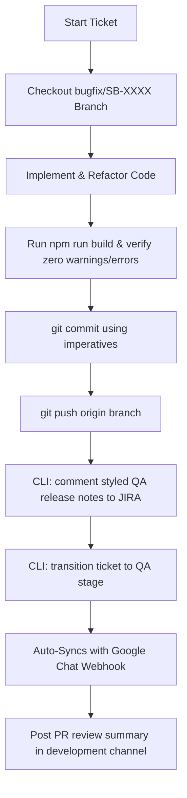

# 🤖 AI Agent & Developer Automation Playbook

This document is the **Unified Engineering & DevOps Playbook** for Scholarbee development teams and AI agents. It consolidates all guidelines for JIRA workflow transitions, Git branching/commit conventions, PR formatting, and automated Google Chat communication.

> [!IMPORTANT]
> **CRITICAL BRANCHING & COMMIT SAFETY RULES (MANDATORY FOR ALL AI AGENTS):**
>
> 1. **NEVER DIRECTLY COMMIT OR PUSH TO `main` OR `development` BRANCHES** in both **Super Admin Portal** and **Student Portal** repositories. You MUST always create and work on a proper ticket branch (e.g., `bugfix/SB-XXXX` or `feature/SB-XXXX`).
> 2. **ALWAYS ASK THE USER FOR EXPLICIT CONFIRMATION BEFORE RUNNING GIT COMMIT OR PUSH COMMANDS.** You must only perform git commit and push operations if the user has explicitly requested it in the active chat context (e.g. "commit and push").

---

## 🛠️ 1. Jira & Google Chat DevOps Integration

This workspace utilizes a high-performance, zero-dependency Node.js CLI tool (`scripts/jira.js`) to bridge local development work with **Jira Cloud** and **Google Chat** workspaces.

### 🔑 Local Credentials Config (`.env.jira`)

To run the developer integration, you must configure a `.env.jira` file in the root directory.

> [!WARNING]
> This file is explicitly ignored in `.gitignore` and must **NEVER** be committed to Git.

```env
JIRA_EMAIL="ali@scholarbee.pk"
JIRA_TOKEN="YOUR_ATLASSIAN_API_TOKEN"
JIRA_HOST="scholarbee-team.atlassian.net"
GOOGLE_CHAT_WEBHOOK="https://chat.googleapis.com/v1/spaces/..."
GITHUB_TOKEN="YOUR_GITHUB_PERSONAL_ACCESS_TOKEN"
```

### 💻 Developer CLI Commands Reference

Ensure your `.env.jira` configuration is loaded. Run commands from the project root:

#### A. View Ticket Details

Queries Jira Cloud to output summary, status, assignee, and parsed descriptions.

```bash
node scripts/jira.js SB-1514
# Or: node scripts/jira.js view SB-1514
```

#### B. Post a Styled QA Comment (With Active Mentions)

Adds styled comments to Jira tickets supporting active user tags. Standard text names (like `@aliza`, `@Meqdad Ali`, and `@Sharjeel Ejaz`) are dynamically parsed into Jira's rich account nodes.

```bash
node scripts/jira.js comment SB-1514 "Hi @aliza, @Meqdad Ali, and @Sharjeel Ejaz,

**QA Verification & Testing Guide**

- Replaced previous accordion filters with a sleek bottom drawer `<Drawer>` sheet."
```

#### C. Transition Ticket Status (Triggers Automatic Google Chat Sync)

Transitions a ticket's workflow status. Moving a ticket to `"QA"` automatically queries Jira for the latest release notes comment, parses the Atlassian Document Format (ADF) into chat markdown, and dispatches a detailed notification to Google Chat in real-time.

```bash
node scripts/jira.js transition SB-1514 "QA"
```

_Available States:_ `To Do`, `In Progress`, `QA`, `Resolved`, `Closed`, etc.

#### D. Send Custom Messages or Ticket Snapshots to Google Chat

```bash
# Custom plain text message:
node scripts/jira.js chat "Deployment started for next release."

# Dynamic card preview of a specific ticket:
node scripts/jira.js chat SB-1514
```

#### E. Automate GitHub Pull Request Creation (Figma & JIRA Integrated DevOps)

Queries JIRA for details, calculates git modified files/shortstat comparison against `development` branch, creates a fully formatted PR on GitHub targeting the `development` branch, adds JIRA comment with QA release notes and PR link, and transitions the ticket state to `"QA"` (dispatches Google Chat cards automatically!).

```bash
node scripts/jira.js pr SB-1503
```

---

## 🌿 2. Git Branching & Commit Conventions

Always match work to formal Git standards to guarantee clean history and traceable pipelines.

> [!WARNING]
> Direct commits/pushes to primary branches (`main` or `development`) are strictly forbidden in both **superadmin-portal** and **student-portal** workspaces. You must always create a new ticket-specific branch first.
> Additionally, **always ask the user for permission before staging, committing, or pushing any code.**

### 🌿 Branch Naming Conventions

Match local branch names to active ticket references:

- **Format:** `[TICKET]` or `[TICKET]-[brief-description-slug]`
- **Examples:**
  - `bugfix/SB-1514`
  - `feature/SB-1000-enable-campus-selection`

### ✍️ Commit Message Structure

Use the following format for all local commits:

```
[TICKET]: [Brief Description]

[Optional detailed explanation]

[Optional bullet points for multiple changes]
```

#### Title Guidelines (First Line)

- **Ticket Prefix:** Always start with the ticket ID (e.g. `SB-1514: `).
- **Imperative Mood:** Write in present tense ("Add feature", **never** "Added feature" or "Adds feature").
- **Conciseness:** Keep the first line under 50 characters, capitalize the first letter, and omit trailing periods.

#### Action Verbs

Start commit titles and description bullets with these imperative verbs:

- **Add** - New feature or file
- **Fix** - Bug fix
- **Update** - Modify existing code
- **Remove** - Delete code or feature
- **Refactor** - Restructure code without behavioral changes
- **Improve** / **Enhance** - Upgrade existing functionality
- **Optimize** - Improve performance or resource efficiency

---

## 📝 3. PR & Code Review Standards

When preparing a Pull Request or drafting a review notification post for development channels, follow this structure:

### 📋 PR Review Channel Post Template

```
PR Review: [TICKET_NUMBER] - [Brief Title Description]

[PR_LINK]

[One-line summary of what the PR does and why it's important]

- [Action Verb in Past Tense] [What was done] [Brief technical context]
- [Action Verb in Past Tense] [What was done] [Brief technical context]

**Files Changed:**
- [File path 1] - [Brief description of changes]
- [File path 2] - [Brief description of changes]

**Summary:**
- [X] files changed, [Y] insertions(+), [Z] deletions(-)
- [Brief summary of overall user & technical impact]
```

### ✍️ Past-Tense Action Verbs for PRs

Use past-tense verbs at the start of PR bullet points:

- **Refactored** - Restructured code without functional alterations
- **Implemented** - Added new feature/component
- **Added** - Introduced new items or files
- **Fixed** - Resolved a bug or layout discrepancy
- **Improved** / **Enhanced** - Upgraded existing flows
- **Optimized** - Enhanced code efficiency or rendering performance
- **Updated** - Modified existing configuration or parameters

---

## 🚀 4. End-to-End Automation Workflow

Follow this systematic checklist for every task:



### 📋 Execution Checklist

1. **Initialize:** Checkout a new branch matching the ticket: `git checkout -b bugfix/SB-XXXX`.
2. **Build & Verify:** Ensure the developer server builds correctly (`npm run build` or `yarn dev --turbo`) with zero TypeScript, linting, or formatting warnings.
3. **Commit:** Stage and commit modifications following imperatives: `git commit -m "fix(SB-XXXX): update responsive filters"`.
4. **Push Branch:** Push branch to remote repository: `git push origin bugfix/SB-XXXX`.
5. **Post QA Notes:** Submit testing instructions onto Jira using the CLI:
   ```bash
   node scripts/jira.js comment SB-XXXX "Hi @aliza, @Meqdad Ali, and @Sharjeel Ejaz - Ready for testing! ..."
   ```
6. **Workflow Transition:** Transition ticket status to QA. This automatically fires the Google Chat webhook notification:
   ```bash
   node scripts/jira.js transition SB-XXXX "QA"
   ```
7. **Submit PR:** Create a pull request on GitHub and post a structured PR review card using the channel template.
